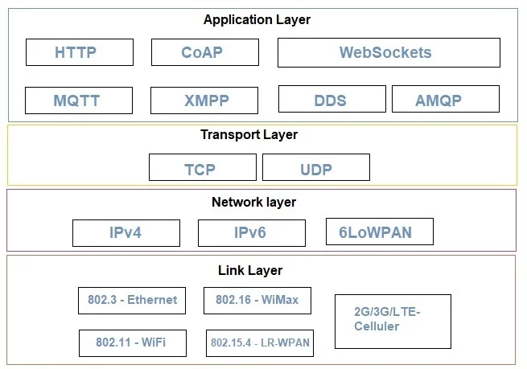

# Physical Design of IoT
### 1. Things (Devices)
Iot devices that have unique identity, can perform sensing, actuating, monitoring  
These Device can
- Exchange data with connected devices
- Collect data and process
- Send data to centralized servers
- Perform some task locally

---
### 2. Protocols

| Feature                  | **MQTT**                                                 | **CoAP**                                                           |
| ------------------------ | -------------------------------------------------------- | ------------------------------------------------------------------ |
| **Full Form**            | Message Queuing Telemetry Transport                      | Constrained Application Protocol                                   |
| **Protocol Type**        | Messaging Protocol                                       | Web Transfer Protocol                                              |
| **Underlying Transport** | TCP (connection-oriented)                                | UDP (connectionless)                                               |
| **Architecture**         | **Publish/Subscribe** (with Broker)                      | **Client/Server** (like HTTP)                                      |
| **Message Pattern**      | Asynchronous                                             | Synchronous                                                        |
| **Designed For**         | Real-time communication in low-bandwidth environments    | Lightweight communication for constrained devices                  |
| **Reliability**          | High (supports message delivery guarantees: QoS 0, 1, 2) | Lower (since it uses UDP, less reliable)                           |
| **Overhead**             | Low                                                      | Very low                                                           |
| **Security Support**     | TLS/SSL                                                  | DTLS (Datagram TLS)                                                |
| **Use Cases**            | Live sensor data, home automation, chat apps             | Smart lighting, smart locks, local control in constrained networks |

---
