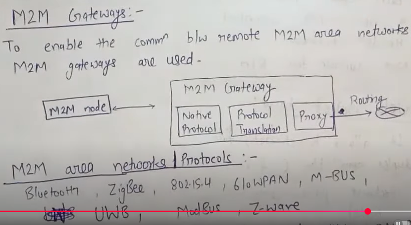

# IOT VS M2M

## M2M
Direct communication between devices (machines) using wired or wireless communication without human intervention

Characteristics:  
1. Point-to-point communication: Typically, M2M connects devices in a network thatexchanges data directly.
2. Proprietary networks: Often uses cellular, satellite, or private networks.
3. Automation: Devices exchange information to perform tasks automatically.
4. Limited scope: Usually focuses on specific industrial or enterprise applications.
5. Less internet-centric: Can work over private or closed networks, not necessarily using internet protocols.

---
## 
 Differences

| Feature               | **M2M**                                 | **IoT**                                                |
| --------------------- | --------------------------------------- | ------------------------------------------------------ |
| **Scope**            | Narrow, Device-to-device communication          | Broad, System of interconnected smart devices                 |
| **Connectivity**            |  Can use cellular, satellite, or private networks          |  Mainly internet-based (IP networks)                 |
| **Data Handling**     | Local, basic data exchange              | Cloud storage, real-time data processing and analytics |
| **Communication Type**      | Point-to-point (often private networks) | Internet-based, cloud-connected networks               |
| **Technology**        | Cellular, wired (Ethernet), SMS         | Wi-Fi, Bluetooth, Zigbee, LoRa, cloud platforms        |
| **Scalability**       | Limited                                 | Highly scalable and flexible                           |
| **Human Interaction** | None or minimal                         | Often includes apps, dashboards, notifications         |
| **Example**           | Smart meter reporting energy usage      | Smart home adjusting lights and AC based on behavior   |
