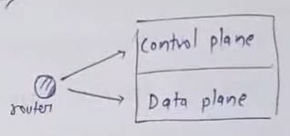
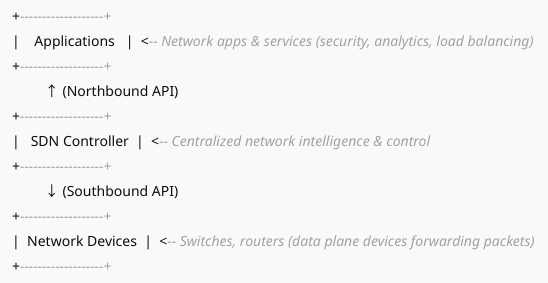

# SDN
Software Defined Networks  
- Approach to networking that separates the control plane (which decides where traffic is sent)  from the data plane (which forwards traffic to the selected destination).  
- Approach to networking that uses software-based controllers or APIs to direct traffic on the network and manage network resources  dynamically, rather than relying solely on traditional hardware-based network devices like
routers and switches.  
- It centralizes the network controller

## ARCHITECTURE

 Key Concepts in SDN
 1. Control Plane:
 The brain of the network, responsible for making decisions about where traffic is sent. In
 SDN, this is centralized in a software controller.
 2. Data Plane (Forwarding Plane):
 The part of the network that actually moves packets based on rules from the control
 plane.
 3. SDN Controller:
 A centralized software application that controls the network devices, programs their
 behavior, and manages traffic flows.
 4. Southbound APIs:
 Interfaces (like OpenFlow, NETCONF) that allow the SDN controller to communicate with
 network devices and instruct them on how to handle traffic.
 5. Northbound APIs:
 Interfaces used by applications and network services to interact with the SDN controller
 for policy, analytics, and orchestration.
 6. OpenFlow Protocol:
 A widely used southbound protocol that allows the SDN controller to directly program
 the forwarding tables of switches and routers.

## PROS
✅ Easy network management  
✅ Faster deployment of services  
✅ Cost reduction  
✅ High scalability and agility
✅ Real-time monitoring and control  
✅ Dynamic Traffic Management  

## CONS
❌ Security threats to centralized controller  
❌ Complexity in integration with legacy networks   
❌ Standardization issues across vendors  
❌ Scalability of controller in very large networks

