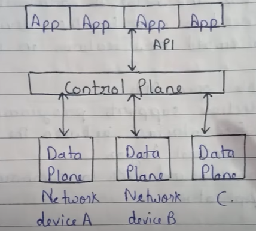

# SDN
Software Defined Networks  
Approach to networking that separates the  
control plane (which decides where traffic is sent)  
from the data plane (which forwards traffic to the selected destination).  
It centralizes the network controller

## ARCHITECTURE

1. **Application Layer**  
Contains SDN apps that request network services  
Communicates with the controller via northbound APIs.

2. **Control Layer**  
The SDN Controller is the brain of the network.  
Manages flow control, routing decisions, and policies.

3. **Infrastructure Layer**  
The actual network devices (switches, routers).  
Follow instructions from the controller via southbound APIs 

## PROS
✅ Easy network management  
✅ Faster deployment of services  
✅ Cost reduction  
✅ High scalability and agility
✅ Real-time monitoring and control  
✅ Dynamic Traffic Management  

## CONS
❌ Security threats to centralized controller  
❌ Complexity in integration with legacy networks   
❌ Standardization issues across vendors  
❌ Scalability of controller in very large networks

