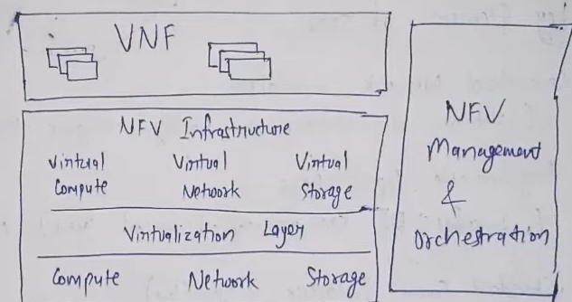

# NFV

- Network function virtualization  
- Uses virtualization to run network functions (like firewalls, routers) on standard servers instead of specialized hardware.
- Provides infrastructure on which SDN can run

## Architecture 

1. Virtual Network Functions (VNFs)  
Software implementations of network functions.  
Example: A firewall running as a software app on a VM.

1. NFV Infrastructure (NFVI)   
The hardware (servers, storage, network) and virtualization layer (e.g., hypervisor) where vnf is deployed  
Provides resources to host the virtual functions.

1. NFV Management and Orchestration (MANO)  
Coordinates, deploys, and manages VNFs and infrastructure.  
Handles lifecycle, scaling, fault recovery.

## Benefits of NFV
✅ Reduces hardware costs (no need for proprietary boxes)  
✅ Faster deployment of services  
✅ Scalable and flexible network  
✅ Easy to update or patch software functions  
✅ Centralized control and automation (when used with SDN)

# 
SDN VS NFV

| Feature        | SDN                                   | NFV                                     |
| -------------- | ------------------------------------- | --------------------------------------- |
| Focus          | Separation of control and data planes | Virtualization of network functions     |
| Focus          | On data centers   | Service providers     |
| Core Component | SDN Controller                        | Virtual Network Functions (VNFs)        |
| Protocol | Uses Openflow communication protocol | No       |
| Functionality | Reduces cost | Increases scalability       |
