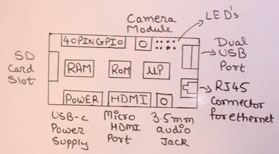

# RESPBERRY PI

Credit card size computer  
Small, low-cost, single-board computer developed by the Raspberry Pi Foundation.  
Runs a Linux-based operating system, typically Raspberry Pi OS (formerly Raspbian).  
Latest : Raspberry Pi 4  

| Feature              | Arduino                                                             | Raspberry Pi                                               |
| -------------------- | ------------------------------------------------------------------- | ---------------------------------------------------------- |
| **Type**             | Microcontroller board                                               | Microprocessor                            |
| **Operating System** | None (runs a single program at a time)                              | Full OS                  |
| **Programming**      | Programmed in C/C++ (Arduino IDE)                                   | Supports multiple languages (Python, C, JavaScript, etc.)  |
| **Memory**           | Very limited                                           | Much larger RAM                     |
| **Storage**          | No built-in storage (program uploaded via USB)                      | microSD card as storage                                    |
| **Connectivity**     | Limited (USB, serial, some Ethernet shields)                        | USB, Ethernet, Wi-Fi, Bluetooth                            |
| **GPIO Pins**        | Many digital and analog pins, great for real-time I/O               | GPIO pins available, but no analog inputs directly         |
| **Multitasking**     | No multitasking, runs one program at a time                         | Can multitask, run multiple apps/processes                 |
| **Power**            | Low power consumption, can run on batteries                         | Requires more power, needs stable supply                   |
| **Price**            | Generally cheaper (\~\$20 or less)                                  | Slightly more expensive (\~\$35 and up)                    |
